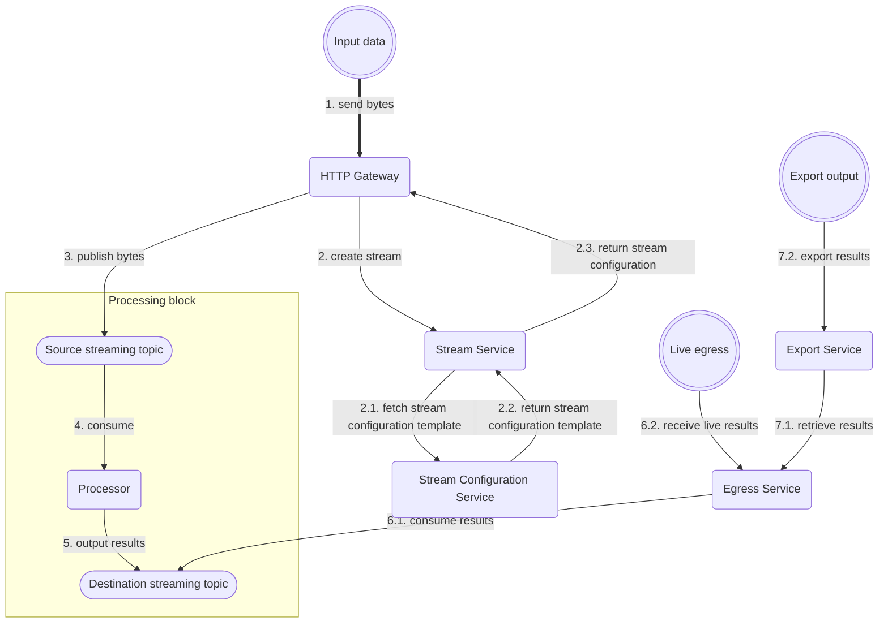

```mermaid
flowchart TB
    gateway("HTTP Gateway")
    streamService("Stream Service")
    streamConfigurationService("Stream Configuration Service")
    egressService("Egress Service")
    exportService("Export Service")
    sourceStreamingTopic(["Source streaming topic"])
    destinationStreamingTopic(["Destination streaming topic"])
    processor("Processor")

    clientInput((("Input data")))
    clientLiveOutput((("Live egress")))
    clientExportOutput((("Export output")))

    subgraph processingBlock["Processing block"]
        direction RL
        sourceStreamingTopic-->|4. consume|processor
        processor-->|5. output results|destinationStreamingTopic
    end

    clientInput==>|1. send bytes|gateway
    gateway-->|2. create stream|streamService
    streamService-->|2.1. fetch stream configuration template|streamConfigurationService
    streamConfigurationService-->|2.2. return stream configuration template|streamService
    streamService-->|2.3. return stream configuration|gateway
    gateway-->|3. publish bytes|sourceStreamingTopic

    egressService-->|6.1. consume results|destinationStreamingTopic
    clientLiveOutput-->|6.2. receive live results|egressService
    exportService-->|7.1. retrieve results|egressService
    clientExportOutput-->|7.2. export results|exportService

```