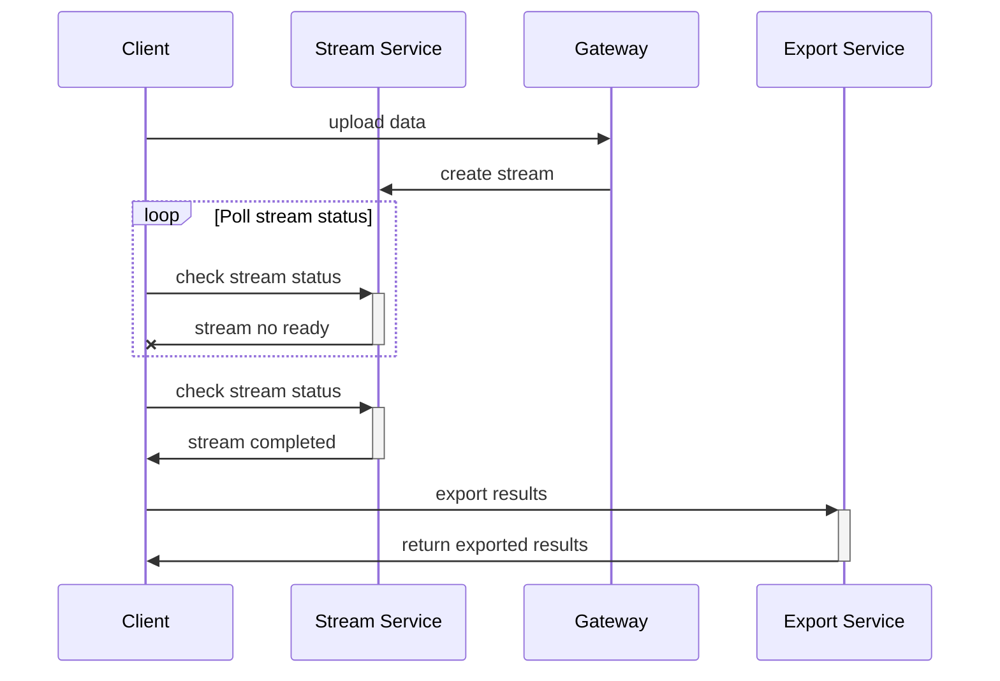

<Note>This section applies only to batch jobs</Note>

# Webhook notification

This is the recommended flow to export results as it does not require constant requests to check stream states, and assures the delivery using the exponential backoff retry mechanism.

```mermaid
sequenceDiagram
    participant U as Client
    participant NS as Notification Service
    participant SS as Stream Service
    participant G as Gateway
    participant ES as Export Service

    rect rgb(82, 82, 82)
    note over U, NS: Webhook registration happens only once
    U->>+NS: register webhook endpoint
    NS->>-U: receive register confirmation
    end

    U->>G: upload data
    G->>SS: create stream
    SS->>NS: push event

    loop Retry with backoff
        NS->>+U: notify webhook
        U-x-NS: return error status or fail to respond in time
    end

    NS->>+U: notify webhook
    U->>-NS: return 200 status code

    U->>+ES: export results
    ES->>-U: return exported results
```

<Note>This method requires an accessible server to receive the notifications.</Note>

# Polling

Use this method for developing and testing, or when exposing an HTTP server is not possible.

